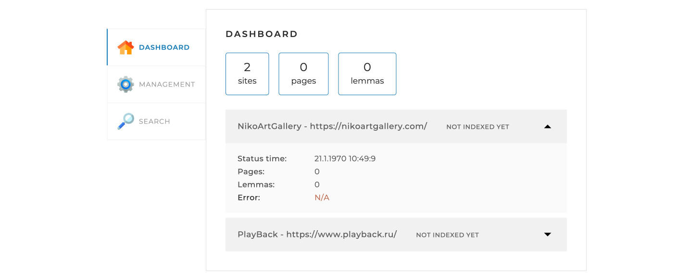
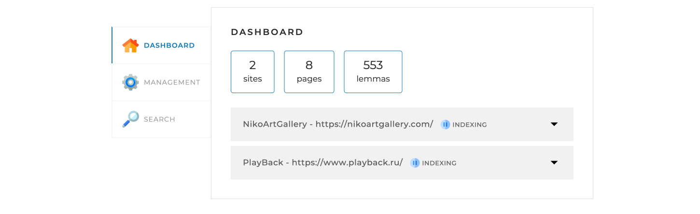
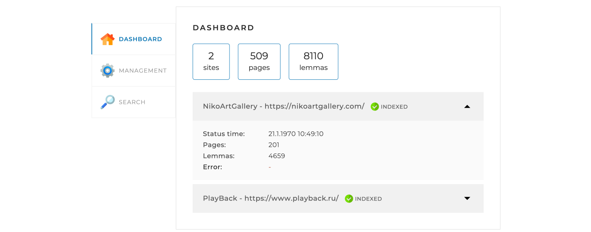
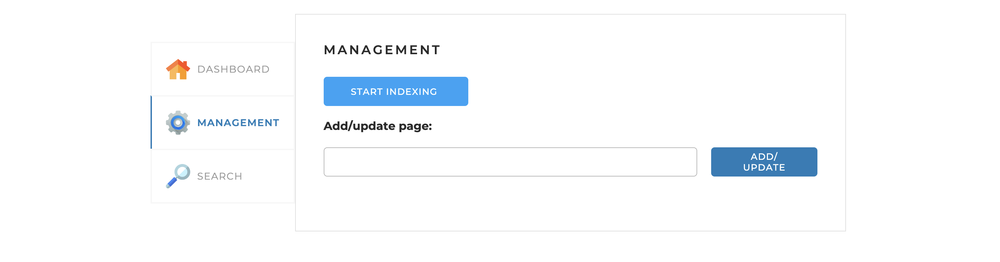
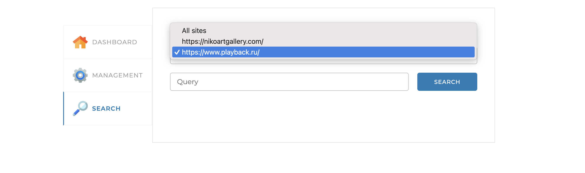
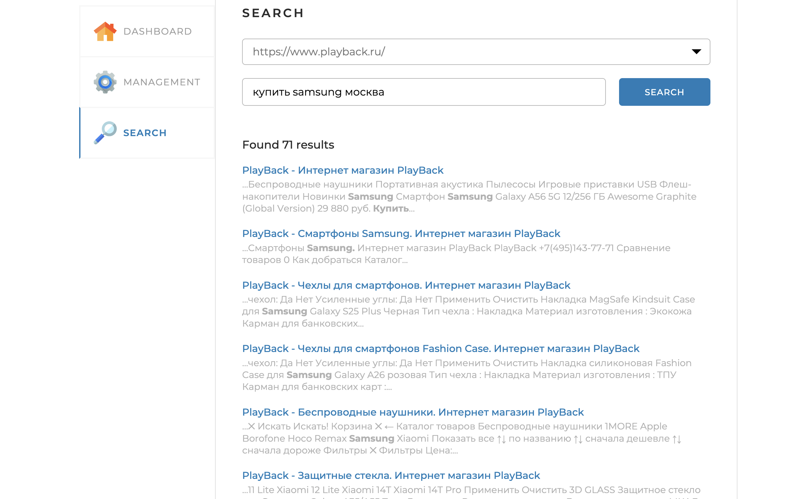
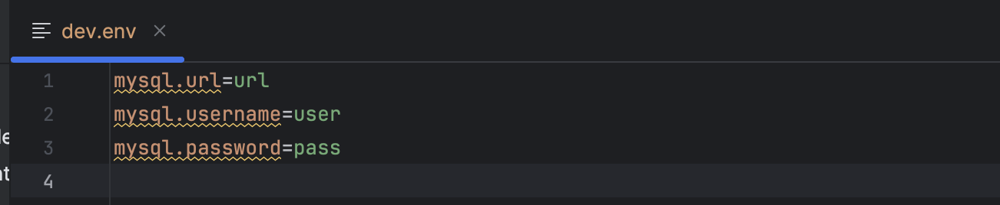
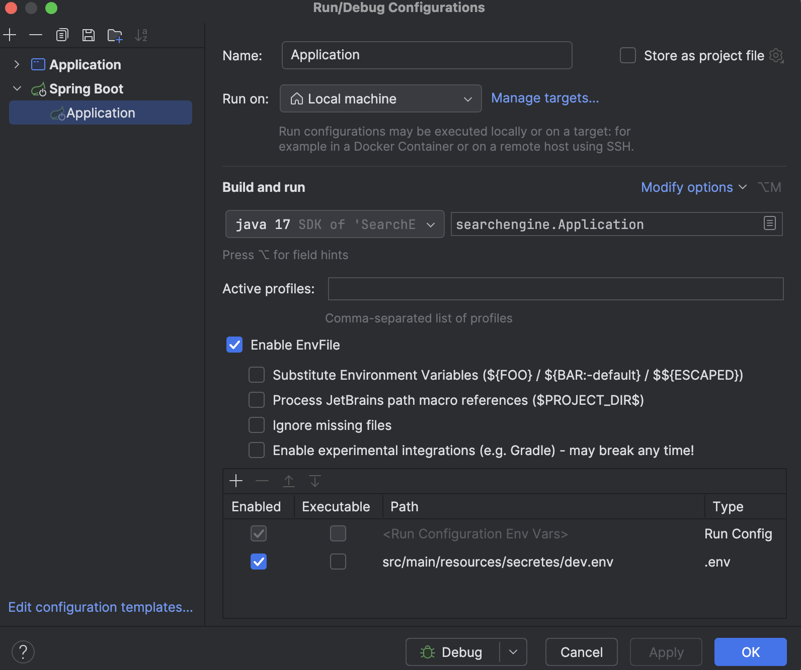
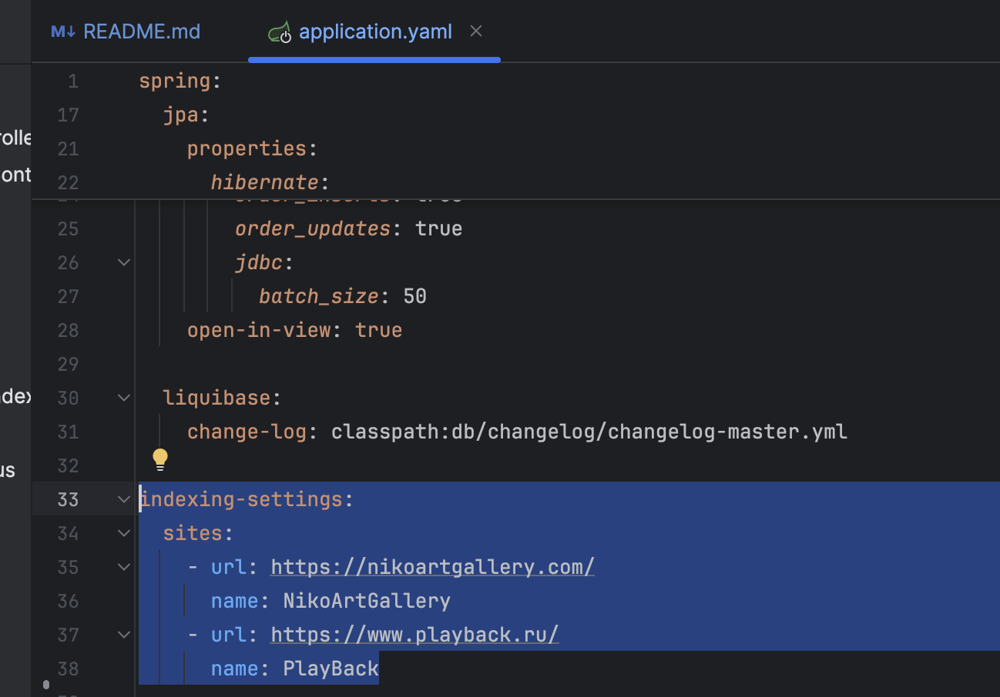

# 🔍 SearchEngine

## 🚀 Описание

SearchEngine — это веб-поисковик по вашим любимым сайтам.  
Он индексирует ресурсы, указанные в конфигурации (`application.yml`), сохраняя страницы, леммы и поисковый индекс в базе данных.  
Через удобный веб-интерфейс можно запускать и останавливать индексацию, переиндексировать отдельные страницы и выполнять поиск по сайтам.

### ⚙️ Как это работает

1. **Конфигурация:** в `application.yml` задаются адреса сайтов для индексации.
2. **Индексация:** движок обходит и сохраняет все страницы заданных сайтов.
3. **Запросы:** пользователь вводит запрос через API, который превращается в список слов в базовой форме.
4. **Поиск:** движок ищет страницы, содержащие все слова запроса. Можно искать по конкретному сайту или сразу по всем.
5. **Ранжирование:** результаты сортируются по релевантности.
6. **Вывод:** результаты отображаются постранично, чтобы было удобно просматривать.### 🖥️ Обзор интерфейса

#### 📊 Вкладка DASHBOARD

По умолчанию открывается эта вкладка. Здесь видно общую статистику индексации и детали по каждому сайту.





#### 🛠️ Вкладка MANAGEMENT

Управляйте поисковым движком через интерактивные кнопки:

- **Запуск/остановка индексации**  
  
  

- **Добавление или обновление отдельной страницы по ссылке**  
  

#### 🔎 Вкладка SEARCH

Для работы с поиском:
- Поле для ввода запроса
- Выпадающий список для выбора сайта
- Кнопка SEARCH для запуска поиска

После нажатия кнопки результаты появляются прямо на странице.





### 🛠️ Технологии

- **Java 17** – язык разработки
- **Spring Boot 3.3.0**
    - Spring Web – создание REST API
    - Spring Data JPA – работа с базой данных
    - Spring Thymeleaf – шаблонизатор для UI
    - Spring Retry – повтор неудачных операций
    - Spring Aspects – аспектно-ориентированное программирование (AOP)
- **MySQL 9.0.0** – база данных
- **Liquibase** – управление миграциями базы данных
- **Hibernate** – ORM для работы с БД
- **Lombok** – генерация шаблонного кода (геттеры, сеттеры и др.)
- **Jsoup** – парсинг HTML-страниц
- **Apache Lucene Morphology** – морфологический анализ (русский и английский языки)
- **Maven** – управление зависимостями и сборкой проекта


### ✨ Особенности

- **⚡ Многопоточность:** обход страниц происходит в многопоточном режиме с использованием Fork-Join.
- **📝 Лемматизация:** все слова приводятся к базовой форме для точного поиска.
- **🌐 Мультиязычность:** поддерживаются русская и английская морфология.
- **📈 Ранжирование:** результаты сортируются по релевантности, чтобы самые важные страницы были наверху.
- **📄 Вывод результатов:** результаты поиска удобно просматривать постранично.


## 🚀 Шаги для локального запуска

1. **Клонирование репозитория:**
    ```sh
    git clone https://github.com/YARMARK/search-engine
    cd search-engine
    ```
   📌 Переходим в директорию проекта после клонирования.

2. **Запуск базы данных:**

   💡 Рекомендуется использовать Docker для быстрого поднятия MySQL:

    ```sh
    docker run --name search-engine-mysql \
      -e MYSQL_ROOT_PASSWORD=root \
      -e MYSQL_DATABASE=search_engine \
      -e MYSQL_USER=username \
      -e MYSQL_PASSWORD=password \
      -p 3306:3306 -d mysql:latest
    ```

   ⚡ Теперь база данных готова к работе с проектом.

3. **Настройка конфигурации:**

    - В корне проекта создайте файл с credentials под именем `dev.env` и пропишите там параметры подключения к базе данных: `url`, `username`, `password`.  
      
    - В IDE (например, IntelliJ IDEA) включите опцию **Env file** в параметрах запуска и добавьте ваш `dev.env`.
      
    - Найдите `application.yml` в корне проекта и в секции `indexing-settings` указать ваши любимые сайты
      

4. **Сборка и запуск проекта:**
    ```sh
    mvn clean install
    mvn spring-boot:run
    ```
   ⚙️ Maven скачает все зависимости, соберет проект и запустит его на встроенном сервере.

5. **Открытие в браузере:**

    - Перейдите по адресу [http://localhost:8080](http://localhost:8080) 🌐  
      Здесь откроется веб-интерфейс поискового движка, где можно запускать индексацию и тестировать поиск.


